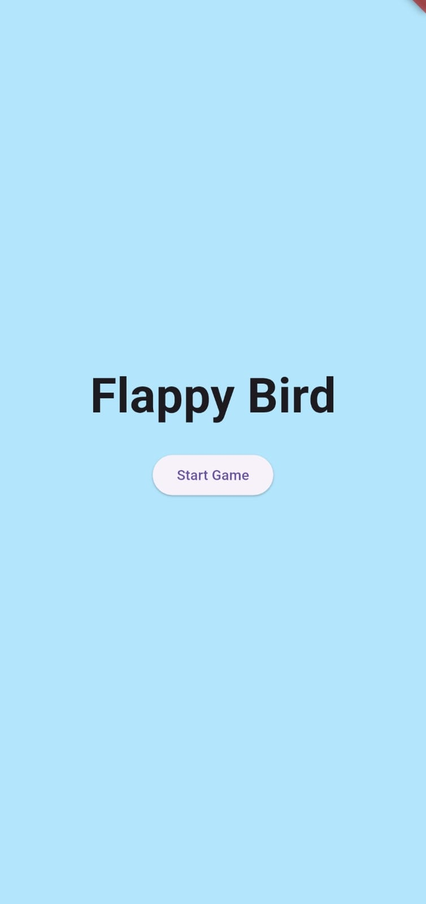
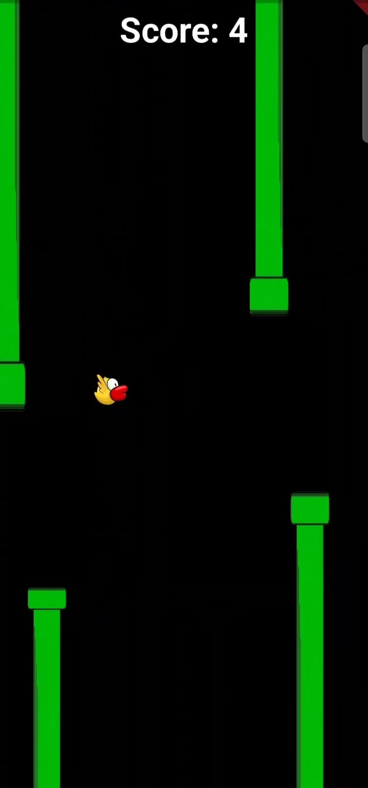
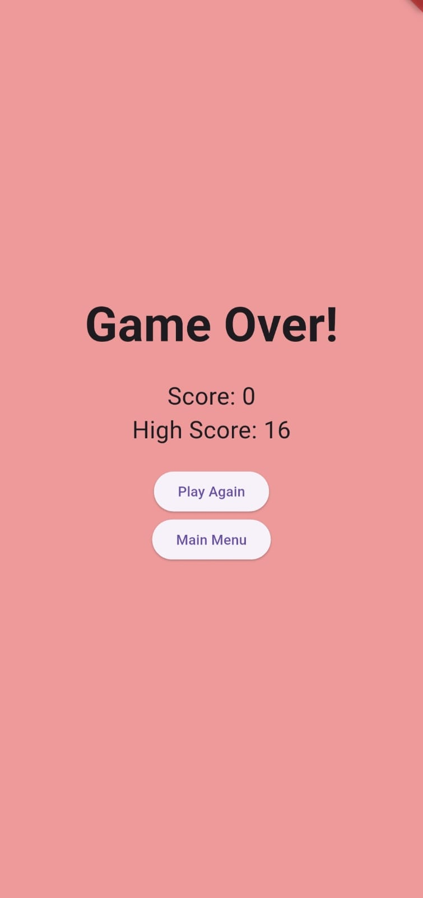

# Flappy Bird Game in Flutter

 <!-- Add a screenshot of your game -->

A Flappy Bird clone built using **Flutter** and the **Flame** game engine. This project demonstrates how to create a simple 2D game with Flutter, complete with gameplay mechanics, score tracking, and high-score saving.

---

## **Features**
- **Gameplay**: Tap to flap the bird and navigate through pipes.
- **Score System**: Earn points by passing through pipes.
- **High Score**: Save and display the highest score using `shared_preferences`.
- **Responsive Design**: Works on both mobile and desktop platforms.
- **Simple UI**: Includes a splash screen, start screen, and game-over screen.

---

## **Screenshots**
| Splash Screen | Start Screen | Game Screen | Game Over Screen |
|---------------|--------------|-------------|------------------|
|  |  |  |  |

---

## **Getting Started**

### **Prerequisites**
- Flutter SDK (version 3.6.2 or higher)
- Android Studio or VS Code (with Flutter and Dart plugins installed)
- A physical device or emulator for testing

### **Installation**
1. **Clone the repository**:
   ```bash
   git clone https://github.com/huzaifashah00/flapy_bird.git
   cd flappy_bird

2. **Install dependencies**:
   ```bash
   flutter pub get

3. **Run the app**:
   ```bash
   flutter run

## **How to Play**
- Tap the screen to make the bird flap and avoid the pipes.
- Pass through the gaps between pipes to earn points.
- The game ends if the bird hits a pipe or the ground.

## **Project Structure**
flappy_bird/
├── assets/
│   ├── images/
│   │   ├── bird.png
│   │   └── pipe.png
├── lib/
│   ├── main.dart
│   ├── screens/
│   │   ├── splash_screen.dart
│   │   ├── start_screen.dart
│   │   ├── game_screen.dart
│   │   └── game_over_screen.dart
│   └── game/
│       └── flappy_bird_game.dart
├── pubspec.yaml
└── README.md


## **Dependencies**
This project uses the following packages:
- Flame: A lightweight game engine for Flutter.
- Shared Preferences: To save and load the high score.


## **Acknowledgements**
- Inspired by the original Flappy Bird game.
- Built with ❤️ using Flutter and Flame.

## **Contact**
If you have any questions or suggestions, feel free to reach out:
- GitHub: [huzaifashah00](https://github.com/huzaifashah00)
- Email: huzaifa.appdev@gmail.com